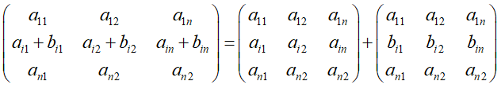

## 行列式的性质

### 转置行列式
> 将行列式的行和列进行对换构成的行列式

### [性质1] 行列式和他的转置行列式相等
### [性质2] 行列式的2行(列)进行对换，行列式变号
### [推论2] 如果行列式有2行(列)完全相同，则此行列式为0
### [性质3] 行列式的某一行(列)中的所有元素同乘一个数，等于k乘此行列式
### [推论3] 行列式中某一行(列)中的所有元素的公因子可以提到行列式的外面
### [性质4] 行列式中有2行(列)元素成比例，此行列式为0
### [性质5] 行列式中某一行(列)中的所有元素都是2数之和，则此行列式等于2个行列式之和

### [性质6] 行列式中某一行(列)中的所有元素乘一个数加到另外一行(列)中，行列式不变

