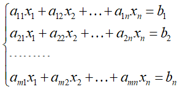
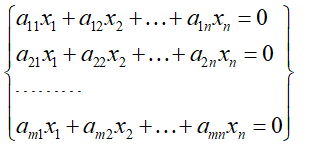

## 线性方程组

### n元非齐次性方程组

### n元齐次性方程组

> 对于n元齐次性方程组来说，一定存在一个零解，但不一定存在非零解

> 对于n元非齐次性方程组来说，一定不存在零解，但不一定存在非零解

## 矩阵
> 由m * n 个数排成的m行n列数表，称为m行n列矩阵。m*n矩阵

> 实矩阵: 元素是实数的矩阵

> 复矩阵：元素是复数的矩阵

> n阶矩阵：行数和列数都等于n的矩阵

> 行矩阵[行向量]： 只有一行的矩阵

> 列矩阵[列向量]： 只有一列的矩阵

> 零矩阵： 元素都是零的矩阵

> 同型矩阵： 2个矩阵的行数和列数相等

> 单位矩阵： 对角线上的元素都是1，其他位置的元素为0的矩阵
